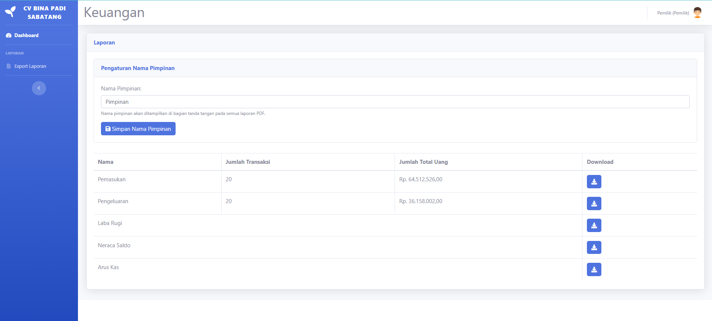

# Aplikasi Sistem Akuntansi CV Bina Padi Sabatang

Sistem akuntansi berbasis web untuk mengelola keuangan CV Bina Padi Sabatang, sebuah perusahaan pertanian yang berlokasi di Padang, Sumatera Barat.

## Fitur Utama

- **Manajemen Transaksi Keuangan**: Catat pemasukan dan pengeluaran secara rinci
- **Manajemen Hutang**: Pantau kewajiban keuangan perusahaan
- **Manajemen Arus Kas**: Lacak pergerakan uang masuk dan keluar
- **Manajemen Neraca Saldo**: Kelola posisi keuangan perusahaan
- **Manajemen Laba Rugi**: Hitung keuntungan dan kerugian
- **Manajemen Karyawan**: Simpan informasi karyawan
- **Laporan Keuangan**: Generate laporan dalam format PDF
- **Sistem Jurnal Otomatis**: Implementasi prinsip akuntansi double-entry
- **Dashboard Analitik**: Visualisasi data keuangan
- **Multi-Level User**: Dukungan untuk admin dan pemilik dengan hak akses berbeda
- **Desain Web 3.0**: Tampilan modern dengan efek glassmorphism dan animasi

## Teknologi yang Digunakan

- **Backend**: PHP 7.4
- **Database**: MySQL
- **Frontend**: HTML, CSS, JavaScript
- **Framework UI**: Bootstrap 4 (SB Admin 2 Template)
- **Library Grafik**: Chart.js
- **Library PDF**: mPDF
- **Library Tabel**: DataTables
- **Animasi**: Anime.js

## Instalasi

1. Clone atau download repository ini ke direktori web server Anda (misalnya `htdocs` untuk XAMPP)
2. Ubah nama folder menjadi `keuangan`
3. Pastikan PHP versi 7.4 digunakan
4. Import database ke MySQL dan beri nama `keuangan`
5. Jalankan aplikasi melalui browser

## Struktur Database

Database `keuangan` terdiri dari beberapa tabel penting:

- `admin`: Informasi login administrator (dengan kolom level untuk multi-user)
- `pemasukan`: Data transaksi pemasukan
- `pengeluaran`: Data transaksi pengeluaran
- `hutang`: Data kewajiban hutang
- `arus_kas`: Data arus kas perusahaan
- `laba_rugi`: Data laba rugi
- `neraca_saldo`: Data neraca saldo
- `karyawan`: Data karyawan perusahaan
- `chart_of_accounts`: Daftar akun akuntansi
- `journal_entries`: Entri jurnal otomatis
- `journal_lines`: Detail baris jurnal

## Tampilan Aplikasi

Berikut adalah beberapa tangkapan layar dari sistem:

### 1. Halaman Login

*Halaman autentikasi dengan desain Web 3.0*

### 2. Dashboard Admin

*Tampilan utama dengan ringkasan keuangan*

### 3. Dashboard Admin

*Tampilan utama dengan ringkasan keuangan*

### 4. Manajemen Pemasukan

*Form untuk mencatat transaksi pemasukan*

### 5. Manajemen Pengeluaran

*Form untuk mencatat transaksi pengeluaran*

### 6. Laporan Keuangan

*Preview laporan keuangan dalam format PDF*

## Hak Akses Multi-Level

Sistem mendukung dua level pengguna:

### Admin
- Akses ke semua fitur sistem
- Manajemen transaksi (pemasukan, pengeluaran, hutang, dll.)
- Manajemen karyawan
- Generate laporan
- Dapat menambahkan admin lain (jika memiliki hak akses)

### Pemilik
- Akses ke dashboard
- Generate laporan
- Tidak dapat mengakses fitur manajemen transaksi harian
- Dapat menambahkan admin lain

## Desain Web 3.0

Sistem menggunakan desain modern dengan:
- Efek glassmorphism
- Animasi halus menggunakan Anime.js
- Layout responsif setengah layar pada halaman login
- Warna formal tanpa gradient
- Interaksi pengguna yang lebih intuitif

## Konfigurasi

Pastikan konfigurasi database benar pada file `koneksi.php`:

```php
$host = 'localhost';
$nama = 'root';
$pass = '';  // Sesuaikan dengan password MySQL Anda
$db = 'keuangan';
```

## Penggunaan

1. Akses halaman login dengan email `admin@gmail.com` dan password `admin` atau `pemilik@gmail.com` dan password `pemilik`
2. Sistem akan otomatis menyesuaikan menu berdasarkan level pengguna
3. Gunakan menu navigasi untuk mengakses fitur-fitur sistem
4. Tambahkan transaksi keuangan melalui menu yang tersedia (tergantung level pengguna)
5. Generate laporan keuangan dari menu Laporan

## Sistem Jurnal Otomatis

Sistem ini menerapkan prinsip akuntansi double-entry dengan membuat jurnal otomatis ketika transaksi dicatat. Setiap transaksi akan menghasilkan entri jurnal yang sesuai dengan prinsip debit-kredit.

## Kontribusi

Silakan fork repository ini dan submit pull request untuk kontribusi pengembangan sistem.

## Lisensi

Proyek ini merupakan proyek internal untuk CV Bina Padi Sabatang dan tidak dilindungi oleh lisensi publik tertentu.

## Tim Pengembang

Sistem ini dikembangkan sebagai solusi internal untuk kebutuhan akuntansi CV Bina Padi Sabatang.